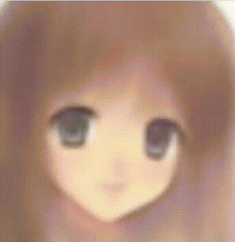
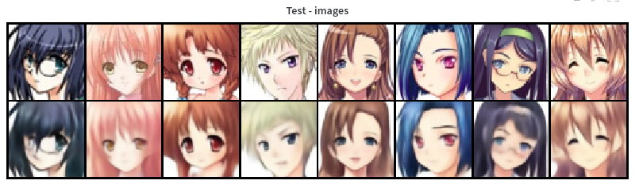
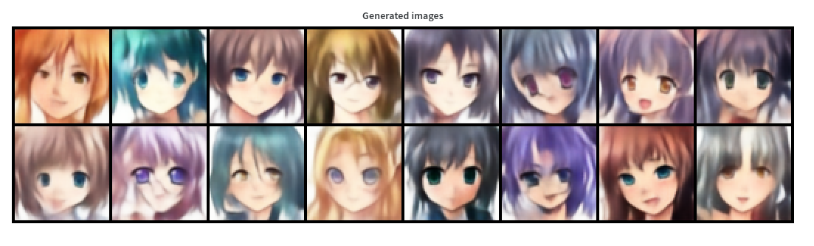
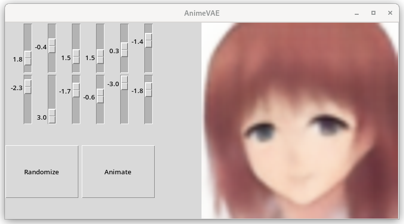

# Anime VAE
<div style="float:left; width: 60%">
  Small tkinter app using a VAE to produce anime faces.

  A Variational Auto-Encoder has been trained on multiple anime faces using this
  [dataset](https://www.kaggle.com/splcher/animefacedataset).

  From this, the decoder is able to produce images from random points in the latent space.
  The tkinter application is an friendly interface to generate random images.
  The application also propose to modify the first principal components in the latent space
  and see the result on the decoded images.

  The WandB project can be found [here](https://wandb.ai/pierrotlc/animevae).
</div>

<div style="float:right;">
  
</div>


## About the model
This is a fully CNN VAE, the latent space is described by a tensor of shape `(latent_size,width,height)`.
This allows little code modification to adapt the model to different images sizes.

The architecture is summarized below using `torchinfo`:
```
==================================================================================================
Layer (type:depth-idx)                                       Output Shape              Param #
==================================================================================================
VAE                                                          [256, 3, 64, 64]          --
├─VAEEncoder: 1-1                                            [256, 2, 128, 2, 2]       --
│    └─CNNEncoder: 2-1                                       [256, 640, 2, 2]          --
│    │    └─Sequential: 3-1                                  [256, 20, 64, 64]         --
│    │    │    └─Conv2d: 4-1                                 [256, 20, 64, 64]         540
│    │    │    └─BatchNorm2d: 4-2                            [256, 20, 64, 64]         40
│    │    │    └─LeakyReLU: 4-3                              [256, 20, 64, 64]         --
│    │    └─ModuleList: 3-2                                  --                        --
│    │    │    └─Sequential: 4-4                             [256, 40, 32, 32]         16,520
│    │    │    └─Sequential: 4-5                             [256, 80, 16, 16]         65,840
│    │    │    └─Sequential: 4-6                             [256, 160, 8, 8]          262,880
│    │    │    └─Sequential: 4-7                             [256, 320, 4, 4]          1,050,560
│    │    │    └─Sequential: 4-8                             [256, 640, 2, 2]          4,200,320
│    └─Sequential: 2-2                                       [256, 2, 128, 2, 2]       --
│    │    └─Conv2d: 3-3                                      [256, 256, 2, 2]          1,474,816
│    │    └─Rearrange: 3-4                                   [256, 2, 128, 2, 2]       --
├─VAEDecoder: 1-2                                            [256, 3, 64, 64]          --
│    └─CNNDecoder: 2-3                                       [256, 20, 64, 64]         --
│    │    └─Sequential: 3-5                                  [256, 640, 2, 2]          --
│    │    │    └─Conv2d: 4-9                                 [256, 640, 2, 2]          737,280
│    │    │    └─BatchNorm2d: 4-10                           [256, 640, 2, 2]          1,280
│    │    │    └─LeakyReLU: 4-11                             [256, 640, 2, 2]          --
│    │    └─ModuleList: 3-6                                  --                        --
│    │    │    └─Sequential: 4-12                            [256, 320, 4, 4]          6,965,120
│    │    │    └─Sequential: 4-13                            [256, 160, 8, 8]          1,741,760
│    │    │    └─Sequential: 4-14                            [256, 80, 16, 16]         435,680
│    │    │    └─Sequential: 4-15                            [256, 40, 32, 32]         109,040
│    │    │    └─Sequential: 4-16                            [256, 20, 64, 64]         27,320
│    └─Conv2d: 2-4                                           [256, 3, 64, 64]          543
==================================================================================================
Total params: 17,089,539
```

This model is stored using LFS.

## About the training
Training is done using Adam and basic transformations (normalizations and vertical flips).
The model is trained with the BCE loss on the normalized images.
Because the model is trained to compress and then reproduce all pixels of the images,
it tends to blur the output and to miss some details.
The final model have been trained on a RTX3080 for 200 epochs for a total of ~3 hours of training.

Here is an example of test images along with their VAE output:


Here is an example of generated images from sampling the latent space:


You can look at the main training run on WandB [here](https://wandb.ai/pierrotlc/animevae/runs/1c8sgcck).
It is a little bit hard to find the right weighting parameter to balance between the BCE loss and the KL-divergence loss.
For the final model, I chose to let the KL-divergence on the loose so that the model could focus a little more on the details of the images.
This means that to get a good sampling from the latent space, you might have to draw to a larger space than the usual normal distribution.
Otherwise, the sampled images could be less diverse than what the model can actually express.

## About the application
The application lets you manually walk into the latent space and visualize the resulting decoded image.
I chose to compute some main PCA components from a random batch of images so that the application can
modify the coefficients of the components directly instead of the raw dimensions of the latent space.
This should lead the higher modifications in the decoded images.



The app can also make a small animation, by repeatedly modifying coefficients of the components.
